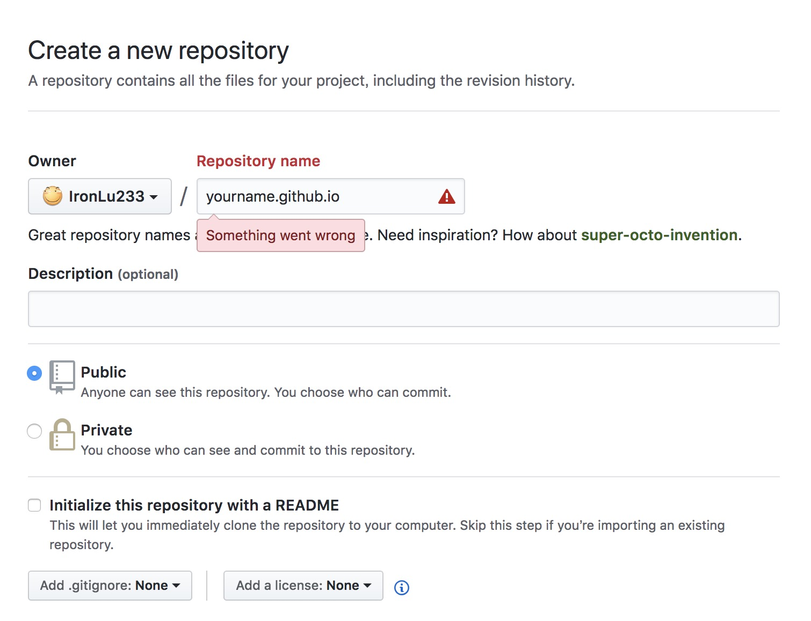

# 使用Vuepress + github pages 快速搭个人主页
## 建目录 && 安装 vuepress
``` sh
mkdir vuepress-demo # 创建一个文件夹
yarn add vuepress # 添加vuepress
```

## 修改package.json，添加调试和编译的npm scripts
``` json{3,4}
{
  "scripts": {
    "dev": "vuepress dev .",
    "build": "vuepress build ."
  },
  "dependencies": {
    "vuepress": "^0.8.4"
  }
}
```
## 调试
``` sh
yarn dev
```
接下来修改本地的Markdown文件，在 http://localhost:8080 中可以预览Blog。*端口可能不一样吧*
根据官方文档，所有的相对路径的引用都会被打包，包括其它Markdown文件，以及图片等资源
## 编译
```
yarn build
```
生成的静态文件会输出到`.vuepress/dist`目录下

## 部署和发布
在github上建一个repo，这个repo的名字为: <Your_name>.github.io

**emmm不知道为什么github似乎不让我用这个名字**

执行下面这段脚本
``` sh
#!/usr/bin/env sh

# 确保脚本抛出遇到的错误
set -e

# 生成静态文件
yarn build

# 进入生成的文件夹
cd .vuepress/dist

git init
git add -A
git commit -m 'deploy'
git remote add origin https://github.com/<Your_name>/<Your_name>.github.io.git
# 请替换上面的<Your_name>
git push origin master -f
```
等几分钟后，访问`<Your_name>.github.io`，我们的主页就托管在了github page上。
