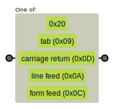
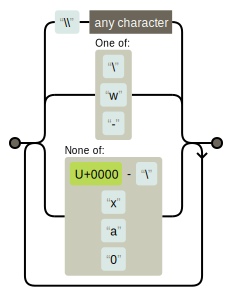
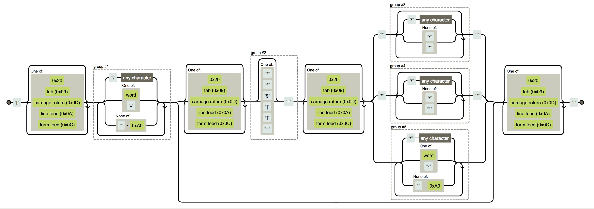
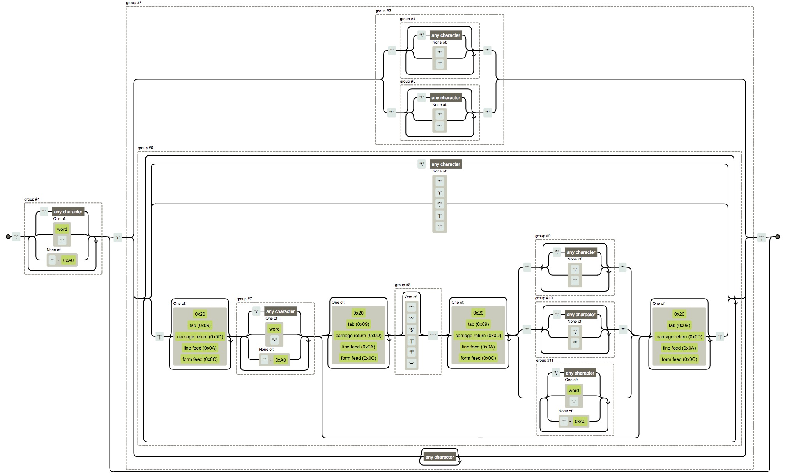

# `Sizzle`(`jQuery`选择器)源码分析（一）
## 正则表达式
各类选择器所使用到的正则表达式
点击图片可查看大图
### 空格
它的正则表达式字面量是这样的`/[\x20\t\r\n\f]/`，匹配逻辑为

### 标识符
标识符(包括标签，类，和ID)，它的正则表达式字面量是`/(?:\\\\.|[\\w-]|[^\u0000-\\xa0])+/`匹配逻辑如下

### 属性
emmm这个表达式的字面量有点长
`/\[[\x20\t\r\n\f]*((?:\\.|[\w-]|[^-\xa0])+)(?:[\x20\t\r\n\f]*([*^$|!~]?=)[\x20\t\r\n\f]*(?:'((?:\\.|[^\\'])*)'|"((?:\\.|[^\\"])*)"|((?:\\.|[\w-]|[^-\xa0])+))|)[\x20\t\r\n\f]*\]/`

### 伪类
`/:((?:\\.|[\w-]|[^-\xa0])+)(?:\((('((?:\\.|[^\\'])*)'|"((?:\\.|[^\\"])*)")|((?:\\.|[^\\()[\]]|\[[\x20\t\r\n\f]*((?:\\.|[\w-]|[^-\xa0])+)(?:[\x20\t\r\n\f]*([*^$|!~]?=)[\x20\t\r\n\f]*(?:'((?:\\.|[^\\'])*)'|"((?:\\.|[^\\"])*)"|((?:\\.|[\w-]|[^-\xa0])+))|)[\x20\t\r\n\f]*\])*)|.*)\)|)/`

[](https://regexper.com/#%2F%3A%28%28%3F%3A%5C%5C.%7C%5B%5Cw-%5D%7C%5B%5E%00-%5Cxa0%5D%29%2B%29%28%3F%3A%5C%28%28%28'%28%28%3F%3A%5C%5C.%7C%5B%5E%5C%5C'%5D%29*%29'%7C%22%28%28%3F%3A%5C%5C.%7C%5B%5E%5C%5C%22%5D%29*%29%22%29%7C%28%28%3F%3A%5C%5C.%7C%5B%5E%5C%5C%28%29%5B%5C%5D%5D%7C%5C%5B%5B%5Cx20%5Ct%5Cr%5Cn%5Cf%5D*%28%28%3F%3A%5C%5C.%7C%5B%5Cw-%5D%7C%5B%5E%00-%5Cxa0%5D%29%2B%29%28%3F%3A%5B%5Cx20%5Ct%5Cr%5Cn%5Cf%5D*%28%5B*%5E%24%7C!~%5D%3F%3D%29%5B%5Cx20%5Ct%5Cr%5Cn%5Cf%5D*%28%3F%3A'%28%28%3F%3A%5C%5C.%7C%5B%5E%5C%5C'%5D%29*%29'%7C%22%28%28%3F%3A%5C%5C.%7C%5B%5E%5C%5C%22%5D%29*%29%22%7C%28%28%3F%3A%5C%5C.%7C%5B%5Cw-%5D%7C%5B%5E%00-%5Cxa0%5D%29%2B%29%29%7C%29%5B%5Cx20%5Ct%5Cr%5Cn%5Cf%5D*%5C%5D%29*%29%7C.*%29%5C%29%7C%29%2F)
