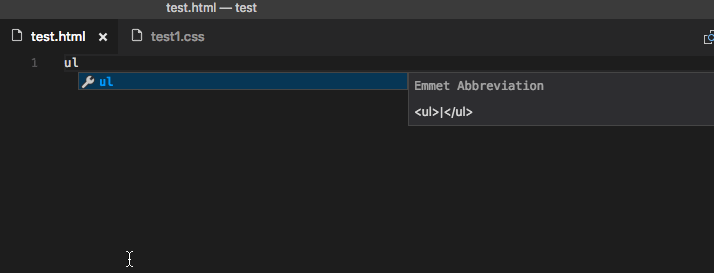
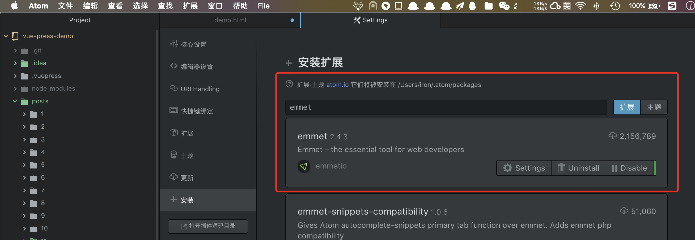
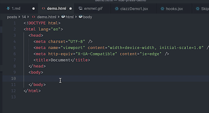
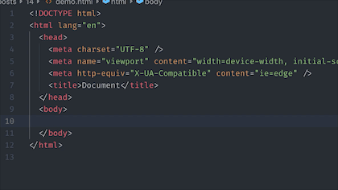

# 用 Emmet 快速搓出一片前端代码(HTML 篇)

## 什么是 Emmet

Emmet 是一个编辑器插件，支持多种编辑器。他通过一定的缩写语法，可以快速生成大片的 HTML 和 CSS 代码。
比如下图
本篇的内容是 HTML 代码的生成。


## 在 IDEs/Editors 中使用 Emmet

PS: 我们可以通过配置，使得 Emmet 在其它文件中起作用，比如.vue 模板或者.jsx 文件

### Visual Studio Code ~~宇宙第一编辑器~~

安装无需任何插件，自带 Emmet。默认支持 jsx 和 vue 文件。


### Atom

1. `Command + ,`打开 Settings, 点击左侧的 install，进入扩展市场。搜索 emmet,安装并重启
2. 重启后打开任意 HTML 文件便可使用 emmet
   
   

### WebStorm

自带，无需安装


### Vim


[请参考这里](https://github.com/mattn/emmet-vim)

## 语法

### 基本 Tag

我们只需要敲标签的名字，按下 Tab(或者是别的快捷键)
我们约定，下方代码 中，箭头左侧是 emmet 语法，右侧是产生的 html，HTML 中的竖线代表光标位置。有多个光标  时，使用 Tab 可切换光标位置

```html
p ->
<p>|</p>

span -> <span>|</span>

blockquote ->
<blockquote>|</blockquote>
```



### 子连接符

在两个标签名字之间使用`>`连接，便可以生成两个有父子关系的标签。这个`>`符号，也是 CSS 中的孩子选择器

```html
div>p>span ->
<div>
  <p><span>|</span></p>
</div>
```



### 兄弟连接符

在两个兄弟标签之间使用`+`连接，便可以生成两个相邻的标签。这个符号也是来自 CSS 的兄弟标签选择器`+`

```html
header+main+footer ->
<header>|</header>
<main>|</main>
<footer>|</footer>
```

### 爬升连接符

我们使用`>`时会进入某个标签的内部，当我们需要使得后面的代码离开当前标签内部时，便需要爬升连接符`^`

```html
div+div>p>span+em^bq ->
<div>|</div>
<div>
  <p><span></span><em>|</em></p>
  <blockquote>|</blockquote>
</div>
```

当然，可以连续使用多个爬升连接符

```html
div+div>p>span+em^^^bq ->
<div>|</div>
<div>
  <p><span></span><em>|</em></p>
</div>
<blockquote>|</blockquote>
```

### 重复连接符

当我们需要批量生成多个标签时，便需要重复连接符，我们仅需要在想要生成的标签后加`*`再加一个数字，便可重复这个标签
下面的例子是生成一个无序列表

```html
ul>li*5 ->
<ul>
  <li>|</li>
  <li>|</li>
  <li>|</li>
  <li>|</li>
  <li>|</li>
</ul>
```

### 分组

仅需要将分为一组的 emmet 使用括号包围，括号内的 emmet 便会成为一个整体。

```html
div>(header>ul>li*2>a)+footer>p ->
<div>
  <header>
    <ul>
      <li><a href=""></a></li>
      <li><a href=""></a></li>
    </ul>
  </header>
  <footer><p></p></footer>
</div>

(div>dl>(dt+dd)*3)+footer>p ->
<div>
  <dl>
    <dt></dt>
    <dd></dd>
    <dt></dt>
    <dd></dd>
    <dt></dt>
    <dd></dd>
  </dl>
</div>
<footer><p></p></footer>
```

### 属性操作符

emmet 属性操作符的设计参考了 CSS 中属性选择器的设置，联系 CSS 中的类选择器、ID 选择器和属性选择器可快速记忆语法。

#### ID 和类选择器

在标签名和类名之间用`.`连接，便可以使得生成带类名的 HTML 标签
在标签名和类名之间用`#`连接，便可以生成带 ID 的 HTML 标签

```html
div#header+div.page+div#footer.class1.class2.class3 ->
<div id="header">|</div>
<div class="page">|</div>
<div id="footer" class="class1 class2 class3">|</div>
```

#### 其它属性选择器

参考 CSS 中自定义属性选择器，在标签名后将自定义属性写在`[]`内

```html
td[title="Hello world!" colspan=3] ->
<td title="Hello world!" colspan="3">|</td>
```

### 隐式标签名

当一个 div 标签需要带类名、ID 名、属性名时，我们可以省略这个`div`标签名
这个特性在模板语言 Pug 中也能见到。
| 省略写法 | 等效写法 |
|-----|------|
| .wrap>.content | div.wrap>div.content |
| em>.info | em>span.info |
| ul>.item*3 | ul>li.item\\*3 |
| table>#row\$\*4>[colspan=2] | table>tr#row\$\*4>td[colspan=2]

### 重复连接符`*`中的循环变量

当我们使用`*`的时候，有时候需要取到当前循环的顺序。在 emmet 中使用\$便可以达到这种目的

```html
ul>li.item$*5 ->
<ul>
  <li class="item1">|</li>
  <li class="item2">|</li>
  <li class="item3">|</li>
  <li class="item4">|</li>
  <li class="item5">|</li>
</ul>
```

### 文本

在标签后使用大括号将文本包括其中，便可以生成内部带文本的标签

```html
a{Click me} -> <a href="">Click me</a>
```

## 参考资料

[emmet 官方文档 ](https://docs.emmet.io/)

[Visual Studio Code 关于 Emmet 的帮助文档](https://code.visualstudio.com/docs/editor/emmet)
