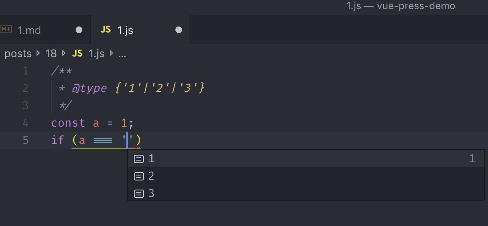
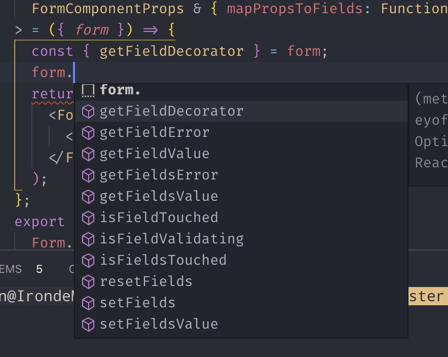
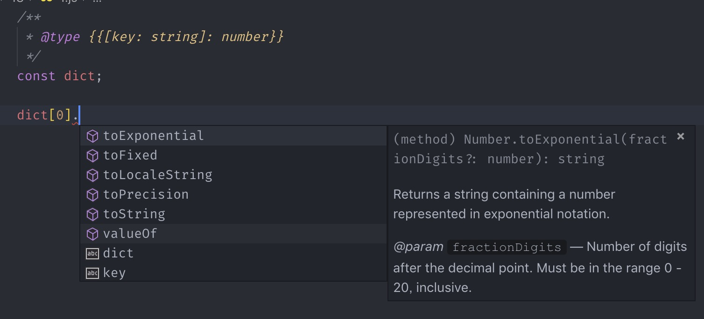

# JSDoc 快乐入门

> 程序员最讨厌的四件事，写注释、写文档、别人不写注释、别人不写文档。

## JSDoc 是什么，为什么我们需要它

### 为什么我们要写注释

JSDoc 首先是文档注释，文档注释是注释。我们写注释的目的，基本上是以下两点

让别人理解你的代码，和让自己理解自己的代码。

第一点容易理解，每个人写代码风格千差万别，我们不能保证他人能接受我们的自己的编程风格（比如我就会用大量的`map`, `reduce`, `filter`等高阶函数辅以老牌函数式编程工具库`lodash`）。注释至少能让他人明白我们代码的意图，知晓意图后，理解代码具体逻辑就会容易一些。另外，各种业务代码中的 Hack，如果不写注释，常常会让后面的维护者疑惑。

第二点，让自己理解自己的代码。在书写新代码时，如果业务复杂，不可避免会导致代码长度增加。注释能让我们帮助我们在脑内对我们写的东西，有个大概的框架，减少写出缺乏大局观的代码的可能。另一种情况，我们自己要在过去自己所负责的那片代码上进行业务迭代。这些注释能帮助我们回忆起之前业务代码上的一些细节。

从上面两方面看来，写注释最大的好处是，减少他人与自己理解代码的成本，并且更容易进入工作状态，更好更快地完成项目迭代，更快地下班，也有更多的时间跑崽。

~~写注释是以极少量的成本，却表达了对同事和自己的爱意~~

### 为什么选择 JSDoc

JSDoc 是一种统一的注释规范，它以`/**`或者`/***`开头，以`*/`结尾。比起 js 中基本的两种注释`//`和`/* */`，它具有以下优点

1. 统一且和谐的注释风格，降低团队内理解文档的成本。
2. 具有一套比较完善的类型系统，提高代码可维护性。
3. 主流的编辑器和 IDE 会对类型注释等提供较好的支持，比如开发工具会提供 JSDoc 的代码片段，通过类型注释提供相应的自动补全提示等等。
4. 无需任何配置，只要学会就能立即在项目中使用并获得收益。

当然，它也有这样的缺点。

1. 类型系统对泛型的支持较羸弱，某些场景下只能退而求其次。
2. JSDoc 具有一定的学习成本，对于未接触过静态类型语言的初学者可能会不好理解。

不过，瑕不掩瑜。对于上面的四点收益，下面的两点缺点也是可以克服和接受的。

## 类型系统

类型，会紧随在 JSDoc 的标签后，,被含在`{`和`}`中。下面是一些例子。

下面的类型系统部分与 TypeScript 中的类型系统有大量相通之处，并且在主流编辑器中，混用他们大部分时候是没有问题的。

```js
/**
 * 标注类型
 * @type {number}
 */
/**
 * 自定义一个类型
 * @typedef SomeType
 * @property {string}
 */
/**
 * 标注返回值
 * @returns {Function}
 */
/**
 * 标注参数
 * @param {boolean} isVisible
 */
```

### 基本类型

此处全当复习 JS 的类型系统，大家都明白的
| 类型 | 含义 |
| ------------ | ------------------------- |
| number | 数字 |
| boolean | 布尔值, `true` or `false` |
| string | 字符串 |
| null | Null 类型 |
| undefined | undefined 类型 |
| object | 代表一切非基本类型 |
| any（或者\*） | 任意类型 |

### 类型组合

#### 数组

数组的表示方法极其简单，既可以在类型后面加方括号，形如`T[]`，也可以`Array<T>`这样写（这里的`T`泛指一切类型）

```js
/**
 * @type {number}
 */
const scores = fetchScore();
```

#### 字符、数字字面量类型

用`|`将每个字面量隔开


#### 联合类型

我们传入的参数可能是多种类型中的某个，便是联合类型的使用场合。它的语法与上面的字面量类型相同。也用`|`隔开。

```js
/**
 * 一个例子
 * @param {number|string} value 具有多种类型的值
 * @param {number} padding 内边距
 */
function padLeft(value, padding) {
  if (typeof padding === 'number') {
    return Array(padding + 1).join(' ') + value;
  }
  if (typeof padding === 'string') {
    return padding + value;
  }
  throw new Error(`Expected string or number, got '${padding}'.`);
}
```

#### 交错类型

交叉类型可以叠加多个类型形成新的类型，这个在 React 组件中给组件的 props 注解类型极为有用。
下面的例子中，Vscode 会自动补全 Ant design 的 Form 属性中的各种相关方法

```js
import * as React from 'react';
import { Form, Input } from 'antd';
import { FormComponentProps } from 'antd/lib/form';

const { Item: FormItem } = Form;

/**
 * @type {React.FC<FormComponentProps & { otherProps: Function }>}
*/
const UserForm:  = ({ form }) => {

  const { getFieldDecorator } = form;
  return (
    <Form>
      <FormItem>{getFieldDecorator('name')(<Input />)}</FormItem>
    </Form>
  );
};
```



#### 索引类型

很多时候我们使用 object 注解类型还不够详细，这个时候，索引类型就出马了。
它的类型是这样写的。`TV`为对象值的类型，可替换为任何类型，`TK`为键类型，必须为`number`或者`string`或者它们的子集（比如用上面提到的字面量类型或者`keyof`关键字）

```js
/**
 * @type {{[key: TK]: TV}}
 */
```



#### 自定义一个类型

自定义类型使用`@typedef`标签定义。
下面的这个例子包含了常用的情况

```js
// 第一种情况，我真的想定义一个新的类型
/**
 * @typedef TableRow
 * @property {number} age 年龄
 * @property {string} name 姓名
 * @property {boolean} isChecked 是否选中
 * @property {string?} ID 身份ID，为空时未登记
 */

// 第二种情况，我想为某个类型定义一个别名
/**
 * @typedef {1|2|3|4|5|6|7|8|9|10|11|12|13|14|15|16|17|18|19|20|21|22|23|24} Hour
 */
```

## 如何在各个场景下使用 JSDoc

下面我会用各种例子来说明，如何在代码中实践 Jsdoc 并获得收益

### 注解方法（公共方法，类方法等）

````js
/**
 * @author Iron<lujianwei@duiba.com.cn>
 */
import sortBy from 'lodash/sortBy';
import last from 'lodash/last';

/**
 * 对数组分组。数组中位置相邻且为连续的数字会被分到一个数组
 * @param {number[]} list 待分组数组
 * @returns {number[][]}
 * @example
 * ``` js
 * groupByConsequent([1, 2, 3, 4, 6, 8, 9, 10, 11, 12, 13, 15]);
 * // 返回值为[[1, 2, 3, 4], [6], [8, 9, 10, 11, 12, 13], [15]]
 * ```
 */
function groupByConsequent(list) {
  return sortBy(list).reduce((prev, current) => {
    const prevGroup = last(prev);
    const prevHour = last(prevGroup);
    if (!prevGroup || (prevHour !== current - 1 && prevHour !== current)) {
      return [...prev, [current]];
    } else {
      return [...prev.slice(0, -1), [...prevGroup, current]];
    }
  }, []);
}

export default groupByConsequent;
````

### 注解 React 组件

#### 函数式组件

在 React 中，无状态的函数式组件的泛型类为`React.FunctionComponent`，或者为`React.FC`，或者为`React.SFC`，如果你的 React 版本 <= 16.8，建议使用`SFC`，否则可用`FC`。而`FunctionComponent`为`FC`的全称，任何版本都可用。`SFC`为 Stateless Function Component。由于 React16.8 更新了 React Hooks，使得函数式组件可以带上状态，因此称为 SFC 是不合适的。

第一个例子，一个业务代码中的 Modal，接收`visible`和`onCloseIndexDetailModal`两个参数。他们的类型分别为 boolean 和 Function

```jsx
/**
 * @typedef ComparableChartIndexModalProps
 * @property {boolean} visible 弹窗可见性
 * @property {Function} onCloseIndexDetailModal 关闭弹窗时的回调
 */

/**
 * 可比较属性点击后的带折线图的弹层
 * @type {React.FunctionComponent<ComparableChartIndexModalProps>}
 */
const ComparableChartIndexModal = ({ visible, onCloseIndexDetailModal }) => {
  return (
    <Modal
      visible={visible}
      width={724}
      footer={null}
      onCancel={onCloseIndexDetailModal}
    >
      <ChartOptionForm />
      <ComparableIndexChart />
    </Modal>
  );
};
```

#### 类组件

就把上面的 Modal 改为类组件。我们需要用`@extend`注解，告诉编辑器和自己，下面的组件继承自`React.Component<ComparableChartIndexModalProps, ComparableChartIndexModalProps>`。其中`ComparableChartIndexModalProps`也是我们上面的属性。`ComparableChartIndexModalState`为组件 state 的类型。之后，我们就能从`this.state`和`this.props`中得到其中的各个带类型的属性。

```jsx
/**
 * @typedef ComparableChartIndexModalProps
 * @property {boolean} visible 弹窗可见性
 * @property {Function} onCloseIndexDetailModal 关闭弹窗时的回调
 */

/**
 * @typedef ComparableChartIndexModalState
 * @property {number} openCount Modal打开的次数
 */

/**
 * 可比较属性点击后的带折线图的弹层
 * @extends {React.Component<ComparableChartIndexModalProps, ComparableChartIndexModalState>}
 */
class ComparableChartIndexModal extends React.Component {
  render() {
    const { visible, onCloseIndexDetailModal } = this.props;

    return (
      <Modal
        visible={visible}
        width={724}
        footer={null}
        onCancel={onCloseIndexDetailModal}
      >
        <ChartOptionForm />
        <ComparableIndexChart />
      </Modal>
    );
  }
}
```

### 注解变量类型

使用`@type`标签注解类型

```js
/**
 * @typedef TableRow
 * @property {number} age 年龄
 * @property {string} name 姓名
 * @property {boolean} isChecked 是否选中
 * @property {string?} ID 身份ID，为空时未登记
 */

/**
 * @type {TableRow}
 */
const row = getCertainRow();
```

### 从外部（.d.ts 文件等）引入类型

```js
// 可以使用直接通过import语句导入的类型
// 如果触发了eslint的unused var规则，可以用第二种方法
import React from 'react';

/**
 * @type {React.FC<{}>}
 *
 */

// 第二种，使用typedef + import引入
/**
 * @typedef {import('antd/lib/form').FormComponentProps} FormComponentProps
 */
```

## 何时使用 JSDoc 注解组件、方法、类型。

对于公共组件和公共方法，通过 JSdoc 注解类型并且写上提示性的问题收益是极大的。这样会使得调用你写的公共组件、方法的同事使用它们的难度，增进同事之间的友情
~~（和基情）~~

对于业务组件，强烈建议书写。业务组件的 props 可能会很长，对 props 类型和含义的注释，能显著减少他人的维护成本。

至于类方法中的各种回调，个人认为有时间可以写一下，让别人更容易明白你的代码。

最后关于变量的类型注释，请酌情考虑自动补全带来的收益与写类型注解的成本。比如 React 中有个`React.CSSProperties`属性，可以告诉编辑器，这个变量是会成为 React 组件的 Style 的，可以考虑使用。

## 最后一些想法

这篇文章讲 JSDoc 与 React，仅仅只是入门用，许多想讲的地方因为篇幅原因未能完善。大家可以移步[JSDoc 官网](http://usejsdoc.org/index.html)和[TypeScript 官网](http://www.typescriptlang.org/docs/handbook/basic-types.html)。特别是类型系统和泛型的使用。
最后，个人对 JSDoc 的看法是

> JSDoc is the gateway to TypeScript!😂
