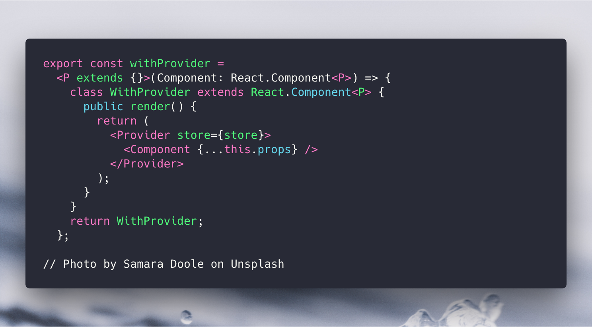
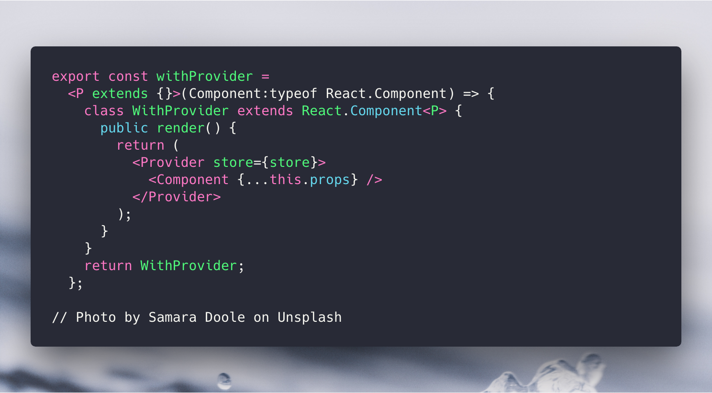
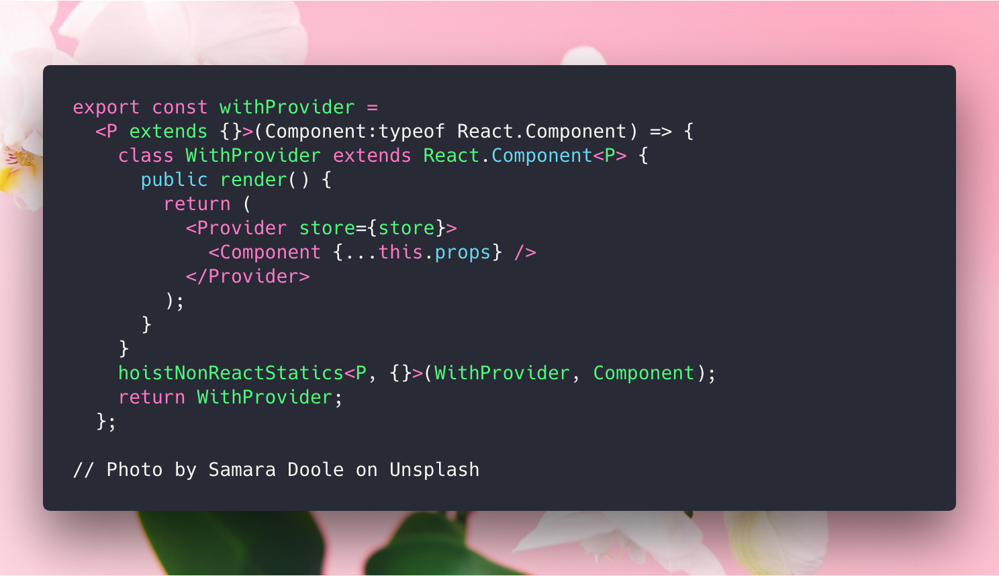

# React 高阶函数与 TypeScript

## Background

在 React-Native 的开发中，遇到一个这样的问题：

在一开始的技术选型上，使用了`react-router`，在页面写好了之后，发现 React-Router 在 React-Native 下有 2 个缺陷

1.  页面始终在一个 Activity 上，当用户点击返回时，会直接退回到桌面
2.  React-Router 的 history.goBack()方法在 iOS 上无效

第一个问题可以通过对`BackHandler`添加 listener 来解决，但第二个问题我并没有找到解决方法。

最终将决定将`react-router`换为`react-navigation`来实现路由和导航。

`react-navigation`的路由声明方式和`react-router`有很大不同，他的路由声明是这样的。

而且`createStackNavigator`返回的`RootStack`组件外不能包裹父组件，否则无法运行，这导致`redux`的 `Provider` 组件不能包裹在`RootStack`外。

## Solution

### 高阶函数(HOC)

通过 React 的高阶函数，使得传入高阶函数的`Component`外层被包裹上`<Provider store={store}><Component /><Provider>`，这样`Component`中的`connect`方法就能从`redux`注入到`component`的`props`中了。

我们先写一个不带类型的`withProvider` (**代码里会留有一些问题，下面会讲到**)

然后我们用 TypeScript 加上类型

接着我们会发现，TypeScript 报了这样一个语法错误:

```
[ts] JSX element type 'Component' does not have any construct or call signatures.
```

通过 Google，在 Stackoverflow 上的
[这里](https://stackoverflow.com/questions/31815633/what-does-the-error-jsx-element-type-does-not-have-any-construct-or-call)
找到了这个问题的答案
在高阶函数的第一层，我们传入的 Component 其实是一个组件的构造函数，而不是 Component 的一个实例。

因此，将 Component 的类型定义为 React.Component 显然是把他当做实例了。我们应该将 Component 的类型定义为: (Component: new (props: P) => React.Component)

当然`typeof React.Component`更简单。一个类的 type 就是他的构造函数

那么我们的代码就可以改成这样


### 解决 Component 静态方法丢失问题

仔细看上面我们写的代码，定义在 Component 上的静态方法并没有被我们加入到外层的 WithProvider 中，在我的这个项目中，`react-navigation`通过读取组件的 static property 中的`navigationOptions`来获取各个 screen 导航栏的配置，当他被 withProvider 包裹之后，`navigationOptions`上的信息就丢失了。我们需要在高阶函数中将`Component`的静态方法和属性复制到`WithProvider`组件中。

```javaScript
// ... the code before.
WithProvider.navigationOptions = Component.navigationOptions;
return WithProvider;
```

当然如果静态的方法和属性比较多，手写复制是比较麻烦的，社区为我们提供了一个偷懒的方式
使用[hoist-non-react-statics](https://github.com/mridgway/hoist-non-react-statics)可以非常愉快地复制这些静态的属性和方法。


### Ref 丢失问题

待更新

## 参考

[TypeScript 官方文档关于 class 类型和构造函数的部分](https://www.typescriptlang.org/docs/handbook/classes.html)

[StackoverFlow](https://stackoverflow.com/questions/31815633/what-does-the-error-jsx-element-type-does-not-have-any-construct-or-call):

[Hoist-non-react-statics](https://github.com/mridgway/hoist-non-react-statics)
