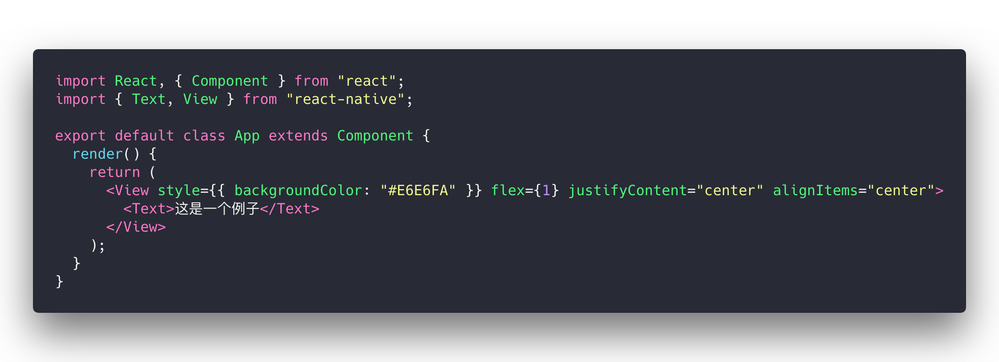
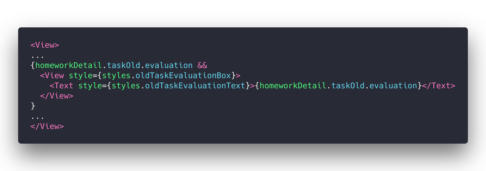
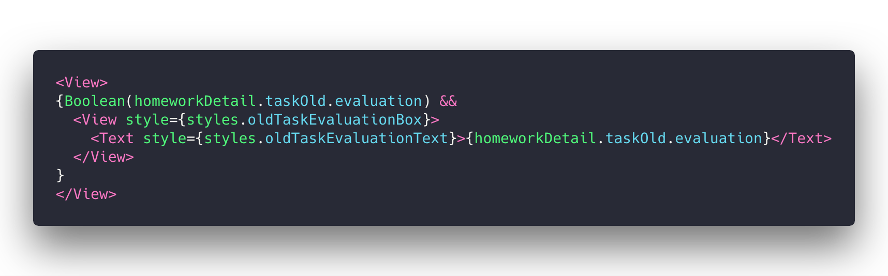
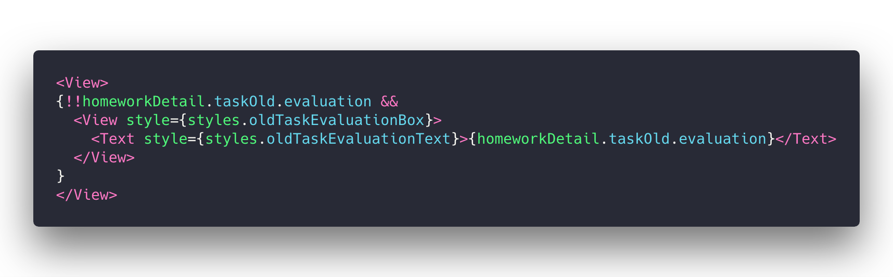
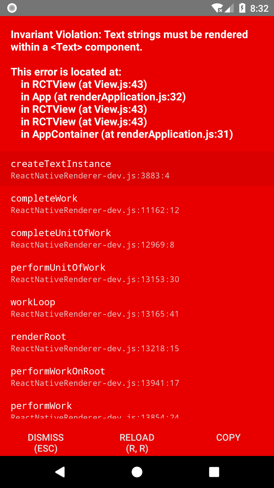

# React Native 使用 && 运算符产生的陷阱
## 问题背景
近期的工作大部分都是关于React Native的。之前使用RN写的旧项目在友盟里报了一个这样的错误
```
java.lang.RuntimeException: Cannot add a child that doesn't have a YogaNode to a parent without a measure function! (Trying to add a 'ReactRawTextShadowNode' to a 'LayoutShadowNode')
...（后面太长省略掉了）
```
## 原因
这个错误之前遇到过，当React Native 渲染出的文字节点并没有被`<Text>`标签包裹时，会出现这样的错误。

随后我用`create-react-native-app`创建了新的Demo,并修改`app.js`中的代码至如下


去掉`<Text/>`标签并运行

当我们的文字节点没有被`<Text>`标签包裹时，React Native会限制这种行为并报错。

这是在React Native 0.50下错误信息（最后会有个0.56版本的错误信息，表意比这个清楚很多）

在我的业务代码中，有这样一段代码

我这段代码中，按照后端给的接口文档，evaluation的类型是`string`或`null`。后端返回的大部分非`null`的数据中，都是非空的字符串。

所以在大部分的情况下，这段代码是可以运行的。

然而，有一种情况，是我当初没有考虑到的。当evaluation字段为**空字符串**时，这个”逻辑与“的表达式会返回 `&&`前面的部分，即`""`，

在React中，render函数会根据返回值的类型不同，选择不同的渲染策略：
- React elements. Typically created via JSX. For example, <div /> and <MyComponent /> are React elements that instruct React to render a DOM node, or another user-defined component, respectively.
- Arrays and fragments. Let you return multiple elements from render. See the documentation on fragments for more details.
- Portals. Let you render children into a different DOM subtree. See the documentation on portals for more details.
- String and numbers. These are rendered as text nodes in the DOM.
- Booleans or null. Render nothing. (Mostly exists to support return test && <Child /> pattern, where test is boolean.)

显然，当为Boolean或者null的时候，React不会渲染任何东西。而对于字符串和数字，那么会渲染一个Text Node 到 DOM上。当React的执行环境为浏览器时，渲染一个空字符串的Text Node 到 DOM上和不渲染任何东西，对于最后显示的效果都是一样的.

然而在React Native环境中，因为Text Node必须被`<Text>`标签包裹的限制，若空字符串被直接渲染，外部没有`<Text>`标签包裹,就会导致这样的错误。
## 解决方法
这个问题要解决其实并不难，只需要用将逻辑与表达式第一个操作数强制转化为Boolean再与第二个操作数`&&`即可。

因此上面的代码改为

或者骚气一点，使用`!!`的trick可以将一个值转化为Boolean。（有些团队这样写可能过不了code review 233）

这个错误告诉我们，React Native环境下，在JSX表达式中使用逻辑与运算符时，一定要避免渲染0或者空字符串到DOM上但没有被`<Text/>`标签包裹的这种情况。
## 参考
[React官网关于render函数对各种不同类型返回值渲染策略](https://reactjs.org/docs/react-component.html#render)
## PS

React Native 0.56在上面所说情况下的报错信息，比起0.50的报错，表达更清楚了。